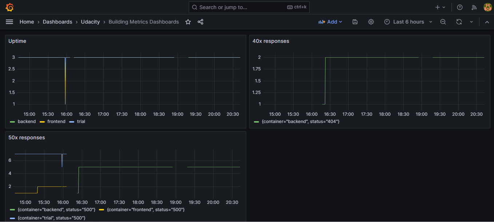

**Note:** For the screenshots, you can store all of your answer images in the `answer-img` directory.

## Verify the monitoring installation

*TODO:* run `kubectl` command to show the running pods and services for all components. Take a screenshot of the output and include it here to verify the installation


## Setup the Jaeger and Prometheus source
*TODO:* Expose Grafana to the internet and then setup Prometheus as a data source. Provide a screenshot of the home page after logging into Grafana.


## Create a Basic Dashboard
*TODO:* Create a dashboard in Grafana that shows Prometheus as a source. Take a screenshot and include it here.


## Describe SLO/SLI
*TODO:* Describe, in your own words, what the SLIs are, based on an SLO of *monthly uptime* and *request response time*.

Monthly uptime: the percentage of time the service is active during a month. For example: Last month the service uptime was 98%;; 

Request response time: time taken between the request and the response returned. For example: the time taken to send the request and to receive the response is 100ms.

## Creating SLI metrics.
*TODO:* It is important to know why we want to measure certain metrics for our customer. Describe in detail 5 metrics to measure these SLIs. 

Latency -> Total Time taken in milliseconds between request/response

Error rate -> Number of http 500 responses in a day
Traffic -> http request/second

Uptime -> Time a service is active in a day

Saturation -> Percentage of memory used


## Create a Dashboard to measure our SLIs
*TODO:* Create a dashboard to measure the uptime of the frontend and backend services We will also want to measure to measure 40x and 50x errors. Create a dashboard that show these values over a 24 hour period and take a screenshot.



## Tracing our Flask App
*TODO:*  We will create a Jaeger span to measure the processes on the backend. Once you fill in the span, provide a screenshot of it here. Also provide a (screenshot) sample Python file containing a trace and span code used to perform Jaeger traces on the backend service.


```Python

@app.route("/star", methods=["POST"])
def add_star():
    with tracer.start_span('star') as span:
        span.set_tag('star', 'star')
        try:
            star = mongo.db.stars
            name = request.json["name"]
            distance = request.json["distance"]
            star_id = star.insert({"name": name, "distance": distance})
            new_star = star.find_one({"_id": star_id})
            output = {"name": new_star["name"], "distance": new_star["distance"]}
            return jsonify({"result": output})
        except:
            logger.error("Error")

```

## Jaeger in Dashboards
*TODO:* Now that the trace is running, let's add the metric to our current Grafana dashboard. Once this is completed, provide a screenshot of it here.


## Report Error
*TODO:* Using the template below, write a trouble ticket for the developers, to explain the errors that you are seeing (400, 500, latency) and to let them know the file that is causing the issue also include a screenshot of the tracer span to demonstrate how we can user a tracer to locate errors easily.

TROUBLE TICKET

Name: John

Date: 11.19.2023

Subject: star endpoint not working

Affected Area: backend service

Severity: Critical

Description: when sending a post request to the star endpoint, the response is "Method Not Allowed" 


## Creating SLIs and SLOs
*TODO:* We want to create an SLO guaranteeing that our application has a 99.95% uptime per month. Name four SLIs that you would use to measure the success of this SLO.

Traffic ->  less then 1000 http request/hour (or 0.27 request/second)

Error rate -> Less then 3 http 500 response in 24h

Uptime -> 99.97% uptime per hour

Saturation -> Percentage of CPU usage less then 90%

## Building KPIs for our plan
*TODO*: Now that we have our SLIs and SLOs, create a list of 2-3 KPIs to accurately measure these metrics as well as a description of why those KPIs were chosen. We will make a dashboard for this, but first write them down here.


Saturation -> Node CPU usage less then 90%

Error rate -> Less then 1 http 500 response in a day per container

Uptime -> Backend service with 99.97% uptime

Traffic ->  less then 0.27 http request/second on each backend container


## Final Dashboard
*TODO*: Create a Dashboard containing graphs that capture all the metrics of your KPIs and adequately representing your SLIs and SLOs. Include a screenshot of the dashboard here, and write a text description of what graphs are represented in the dashboard.  


1) Http requests/second in 1 hour -> 
(sum by (container, pod) (rate(flask_http_request_total{container=~"backend"}[1h])))
2) Backed service uptime -> ((sum(up{service="backend-service"}))/3)*100
3) 50x responses on each backend container -> flask_http_request_total{container=~"backend",status=~"500|503"}
4) Node CPU usage -> instance:node_cpu:ratio

